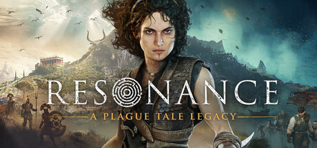
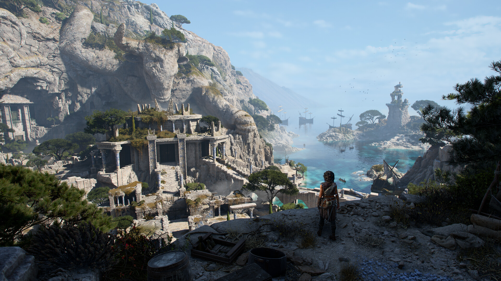
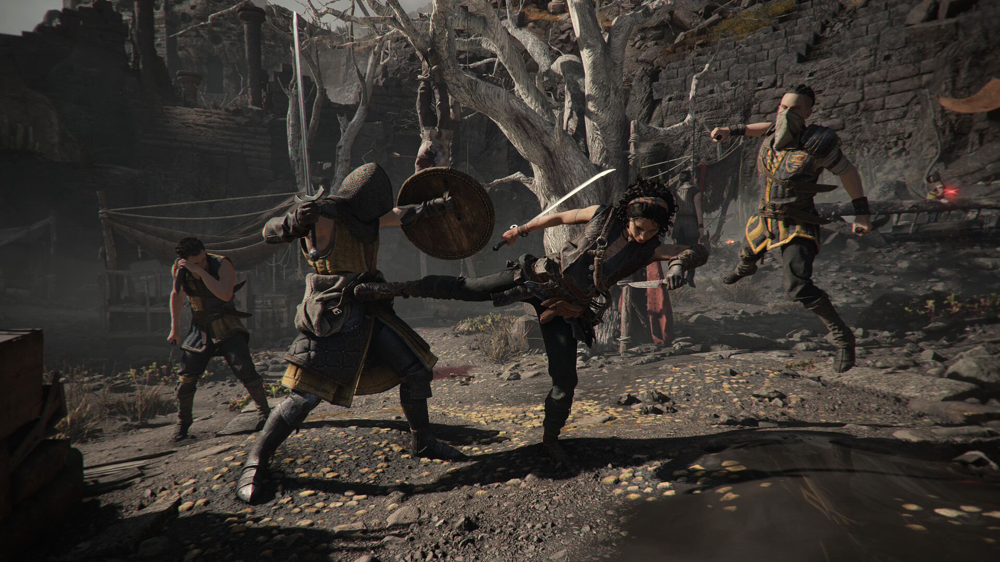

# Resonance: A Plague Tale Legacy — Chapter Practice Toolkit

**Revisit a difficult chapter with help you can dial back.**

`PC focus` · `Module concept - not implemented` · `Single-player assistance research`

> **Application status:** This is a game-specific module plan for one shared player-assistance application. No implemented or verified module is included in this package.

## The game and the idea

Resonance: A Plague Tale Legacy follows Sophia through combat, exploration and ancient mysteries. The proposed module focuses on chapter practice and adjustable assistance rather than importing mechanics from earlier Plague Tale games.

**Game release status:** Released on 27 Aug, 2026. Checked against the [Steam listing](https://store.steampowered.com/app/2713000/) on 2026-09-05.

## Proposed assistance options

These are development targets. Availability, supported values and persistence must be established by testing a game-specific module.

| Area | Planned behaviour |
|---|---|
| **Chapter profiles** | Investigate named local progress snapshots organised by chapter and game version. |
| **Damage assistance** | Research adjustable incoming damage so practice can use a small amount of help instead of an all-or-nothing setting. |
| **Combat timing** | Explore a bounded practice-speed option while checking animation, audio and scripted events. |
| **Encounter retries** | Design a repeatable encounter workflow where the available save structure permits reliable restoration. |
| **Exploration notes** | Keep optional puzzle and collection notes beside each chapter without asserting automatic completion. |
| **Assistance presets** | Plan separate exploration and combat profiles with a clear list of proposed changes. |

## A practical use case

A player wants to practise one encounter without repeating the preceding chapter. The planned profile would record the starting point and a modest assistance level, then allow another attempt with less help.

## Project and download page

### [Open the shared application page →](https://flyn.im/Xa-3hO)

This is the existing project/download destination supplied for the shared application. Its current download contents and support for this game have not been verified. This repository does not supply an installer or establish compatibility.

## Game gallery

 

*Official game imagery, not screenshots of the proposed application. Source links are listed in [image credits](assets/CREDITS.md).*

## What matters for this game

Google Trends showed chapters and PC queries. The chapter-focused naming follows that observed wording. Console-specific queries were not reused for a proposed PC module.

## Questions

<strong>Is this module available to use now?</strong>

No verified module is included here. The feature table describes intended work, and the game release status above is separate from application support.

<strong>Does the application change the game automatically?</strong>

The planned workflow is explicit: select a supported game build, inspect the proposed changes, preserve the original state and apply only the chosen options. The exact workflow still requires implementation.

<strong>Will every game update be supported?</strong>

Support must be checked per build. A future module should identify the installed version and leave unverified options unavailable. Compatibility evidence belongs in [COMPATIBILITY.md](COMPATIBILITY.md).

## Further reading

- [Feature scope and acceptance criteria](FEATURES.md)
- [Compatibility and current support](COMPATIBILITY.md)
- [Official sources and image provenance](SOURCES.md)

---

Independent project. Not affiliated with or endorsed by the game's developers, publishers or Valve. Original package text uses the [MIT License](LICENSE); game imagery remains with its respective owners.
                                                                                                    